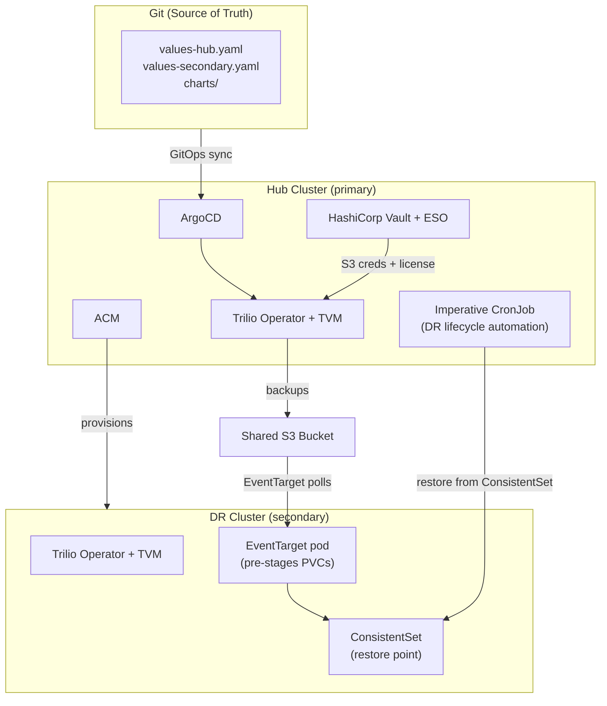

# Trilio Continuous Restore — Red Hat Validated Pattern

[](https://opensource.org/licenses/Apache-2.0)

A GitOps-driven Disaster Recovery (DR) solution for Red Hat OpenShift, built on the [Red Hat Validated Patterns](https://validatedpatterns.io/) framework and powered by [Trilio for Kubernetes](https://docs.trilio.io/kubernetes/).

**For full documentation, see [Document.md](Document.md).**

---

## What This Pattern Does

- Deploys Trilio for Kubernetes on a hub cluster and one or more DR spoke clusters via GitOps
- Continuously pre-stages backup data on DR clusters using Trilio's Continuous Restore (EventTarget) — so recovery requires only metadata retrieval, dramatically reducing RTO
- Automates the full DR lifecycle (backup → restore → validation) on a 10-minute schedule with no human intervention
- Manages secrets (S3 credentials, Trilio license) via HashiCorp Vault and External Secrets Operator (ESO) — never in Git

---

## Architecture



---

## Quick Start

### Prerequisites

- Red Hat OpenShift 4.18 or later on hub and spoke clusters
- S3-compatible bucket accessible from both clusters
- Trilio for Kubernetes 5.3.0+ license key
- `oc` CLI with cluster-admin on the hub
- `ansible-navigator`, `make`, `git`, `python3`
- `rhvp.cluster_utils` Ansible collection:

  ```bash
  ansible-galaxy collection install community.okd kubernetes.core \
    https://github.com/validatedpatterns/rhvp.cluster_utils/releases/download/v0.0.6/rhvp-cluster_utils-0.0.6.tar.gz
  ```

### Deploy

```bash
git clone https://github.com/trilio-demo/trilio-continuous-restore
cd trilio-continuous-restore

# 1. Set your S3 bucket name and region in values-hub.yaml and values-secondary.yaml
# 2. Populate secrets
cp values-secret.yaml.template ~/values-secret-trilio-continuous-restore.yaml
# Edit values-secret.yaml: fill in trilio-license key, S3 accessKey and secretKey

# 3. Install
make install
```

### Validate

```bash
# Trilio health
oc get triliovaultmanager -n trilio-system   # STATUS: Deployed or Updated
oc get target -n trilio-system               # STATUS: Available

# E2E DR status (updated automatically every 10 minutes)
make dr-status
```

### Onboard a DR cluster

```bash
# On hub context
make onboard-spoke CLUSTER=<acm-cluster-name>

# On spoke context — kick initial sync
oc patch application.argoproj.io main-trilio-continuous-restore-secondary \
  -n openshift-gitops --type merge \
  -p '{"operation":{"sync":{}}}'

# Monitor
make spoke-status CLUSTER=<acm-cluster-name>
```

---

## Repository Structure

```
.
├── charts/all/
│   ├── trilio-operand/      # TrilioVaultManager CR, BackupTarget, BackupPlan, RBAC
│   ├── wordpress/           # Sample stateful app (reference workload)
│   └── wordpress-restore/   # Pre-provisioned restore namespace + Hook CR
├── ansible/playbooks/
│   ├── dr-backup.yaml       # Manual backup trigger
│   ├── dr-restore.yaml      # Manual restore (backup or ConsistentSet method)
│   ├── validate-trilio.yaml # Trilio health validation
│   ├── offboard-spoke.yaml  # Spoke teardown
│   ├── offboard-hub.yaml    # Hub teardown
│   └── imperative-*.yaml    # Automated DR lifecycle jobs
├── values-hub.yaml          # Hub: subscriptions, applications, imperative jobs
├── values-secondary.yaml    # Spoke (secondary group): subscriptions, applications
├── values-global.yaml       # Global pattern settings
└── values-secret.yaml.template  # Secret manifest template (never commit the filled copy)
```

---

## Further Reading

- **[Document.md](Document.md)** — full deployment guide, operations, troubleshooting
- [Trilio for Kubernetes documentation](https://docs.trilio.io/kubernetes/)
- [Red Hat Validated Patterns](https://validatedpatterns.io/)
- [Red Hat Advanced Cluster Management](https://access.redhat.com/documentation/en-us/red_hat_advanced_cluster_management_for_kubernetes)
